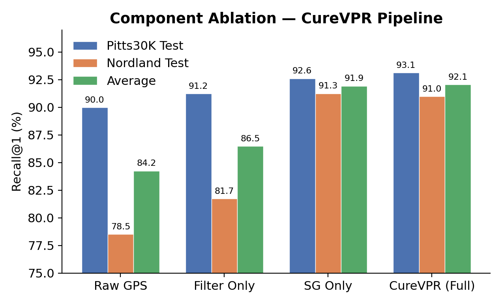
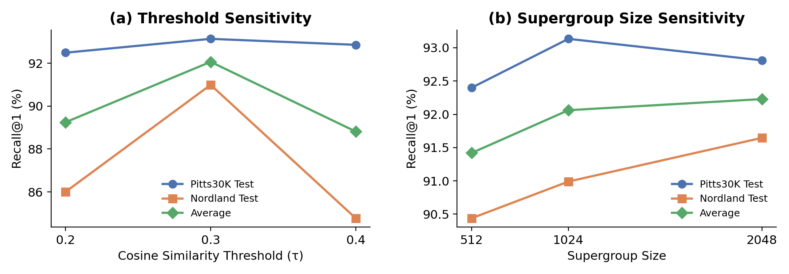

# PlaceForge

[](https://www.python.org/downloads/)
[](https://pytorch.org/)
[](https://lightning.ai/)
[](LICENSE)

A PyTorch Lightning framework for training and evaluating visual place recognition (VPR) models with a focus on **data curation**. PlaceForge implements the **CureVPR** pipeline, which treats GPS metadata as a spatial prior and uses visual embeddings to enforce label consistency -- producing cleaner supervision for contrastive metric learning.

<!--
TODO: Add a pipeline overview diagram here, e.g.:

-->

## Key Results

CureVPR improves Recall@1 by **+7.9 points** over raw GPS supervision on average, with the largest gains on challenging benchmarks like Nordland (+12.5 R@1).

### Component Ablation

Each component of the CureVPR pipeline contributes to the final result:

| Method | Pitts30k R@1 | Nordland R@1 | Avg R@1 |
|--------|:---:|:---:|:---:|
| Raw GPS (baseline) | 90.0 | 78.5 | 84.2 |
| + Coherence Filtering | 91.2 | 81.7 | 86.5 |
| + Supergroups | 92.6 | 91.3 | 91.9 |
| **CureVPR (full)** | **93.1** | **91.0** | **92.1** |

<p align="center">
  
</p>

### Hyperparameter Sensitivity

The pipeline is robust across a range of threshold and supergroup size settings:

<p align="center">
  
</p>

<details>
<summary>Full sensitivity results</summary>

**Cosine Similarity Threshold (tau)**

| tau | Pitts30k R@1 | Nordland R@1 | Avg R@1 |
|:---:|:---:|:---:|:---:|
| 0.2 | 92.5 | 86.0 | 89.2 |
| **0.3** | **93.1** | **91.0** | **92.1** |
| 0.4 | 92.9 | 84.8 | 88.8 |

**Supergroup Size**

| Size | Pitts30k R@1 | Nordland R@1 | Avg R@1 |
|:---:|:---:|:---:|:---:|
| 512 | 92.4 | 90.4 | 91.4 |
| **1024** | **93.1** | **91.0** | **92.1** |
| 2048 | 92.8 | 91.6 | 92.2 |

</details>

## CureVPR Pipeline

The core contribution of this framework is the CureVPR data curation pipeline, which processes GPS-tagged street-level images through four stages:

```
Raw GPS Images ──> Spatial Quantisation ──> Coherence Filtering ──> Supergroup Construction ──> Training
     |                    |                        |                         |
  Noisy GPS         UTM grid cells           Remove outliers          Cluster similar
  metadata         (12.5m, 60deg)           via visual sim.         places for batching
```

1. **Spatial Quantisation** -- partition images into a regular UTM grid (default 12.5m cells, 60-degree heading buckets)
2. **Visual Coherence Filtering** -- iteratively remove images whose embedding similarity to other cell members falls below a cosine threshold, eliminating opposing viewpoints, occlusions, and GPS errors
3. **Supergroup Construction** -- cluster geographically non-adjacent cells into visually similar groups using spherical k-means on place embeddings
4. **Training** -- sample batches from within supergroups so that negatives are visually hard but geographically reliable

| Parameter | Default | Description |
|-----------|:-------:|-------------|
| `cell_size_meters` | 12.5 | Side length of spatial grid cells |
| `heading_size_degrees` | 60.0 | Heading quantisation bucket width |
| `cos_sim_threshold` | 0.3 | Minimum mean cosine similarity for coherence filtering |
| `min_images` | 4 | Minimum surviving images per place |
| `supergroup_size` | 1024 | Target number of places per supergroup |

## Setup

Requires Python >= 3.10.

```bash
pip install -r requirements.txt
```

Optionally pre-download model weights for offline compute nodes:

```bash
python prefetch_models.py
```

### Environment Configuration

Create a `.env` file in the project root with paths to your data directories:

```
PLACEFORGE_RAW_DIR=/path/to/raw/datasets
PLACEFORGE_PROCESSED_DIR=/path/to/processed
PLACEFORGE_FEATURE_STORE_DIR=/path/to/feature_store
```

| Variable | Purpose |
|----------|---------|
| `PLACEFORGE_RAW_DIR` | Root directory containing raw downloaded datasets (SF-XL, GSV-Cities, etc.) |
| `PLACEFORGE_PROCESSED_DIR` | Output directory for processed train/val/test parquet files |
| `PLACEFORGE_FEATURE_STORE_DIR` | Cache directory for computed embeddings and pipeline step outputs |

## Usage

All commands are run from the `src/` directory via the `placeforge` CLI (or `python -m cli`).

### 1. Process datasets

Data pipelines read raw images, compute embeddings, assign geographic place IDs, apply coherence filtering, construct supergroups, and export parquet files.

```bash
# Training data
placeforge datapipeline sf_xl_train
placeforge datapipeline gsvcities_sf_xl_pitts30k_msls_train

# Validation and test sets
placeforge datapipeline pitts30k_val
placeforge datapipeline pitts30k_test
placeforge datapipeline msls_val
placeforge datapipeline tokyo247_test
placeforge datapipeline nordland_test
placeforge datapipeline svox_test

# List all available pipelines
placeforge datapipeline --list
```

Or use the Makefile targets:

```bash
make datapipelines_train
make datapipelines_val
make datapipelines_test
```

### 2. Train a model

```bash
placeforge train configs/train/sf_xl/selavpr_base_boq.yaml
placeforge train configs/train/sf_xl/selavpr_base_boq.yaml --resume
```

Training configs are YAML files specifying the model, optimiser, dataset, and augmentation settings. Checkpoints are saved to `checkpoints/<logger_name>/` as `best.ckpt` (by R@1) and `last.ckpt`.

### 3. Evaluate

```bash
placeforge test configs/train/sf_xl/selavpr_base_boq.yaml --best
placeforge test checkpoints/my_run/ --best
placeforge test path/to/model.ckpt
```

Reports Recall@1/5/10 on the configured test datasets and saves results as YAML.

### 4. Run ablations

Generate all ablation datasets and train:

```bash
# Data pipelines (7 variants)
make datapipelines_train_ablation

# Training (8 configs covering component, threshold, and supergroup size ablations)
placeforge train configs/train/ablations/raw_gps.yaml
placeforge train configs/train/ablations/sg_only.yaml
placeforge train configs/train/ablations/filter_only.yaml
placeforge train configs/train/ablations/full.yaml
placeforge train configs/train/ablations/tau02.yaml
placeforge train configs/train/ablations/tau04.yaml
placeforge train configs/train/ablations/sg512.yaml
placeforge train configs/train/ablations/sg2048.yaml
```

### 5. Regenerate figures

```bash
python scripts/generate_figures.py
```

Reads metric YAML files from `checkpoints/train/ablations/` and saves charts to `assets/`.

### 6. HPC / SLURM

```bash
sbatch submit_train_job.sh configs/train/sf_xl/selavpr_base_boq.yaml
```

See [HPC_SETUP.md](HPC_SETUP.md) for cluster-specific setup, including offline model caching and WANDB sync.

## Supported Models

### Trainable

| Model | Backbone | Aggregation | Config key |
|-------|----------|-------------|------------|
| SelaVPR++ Base BoQ | DINOv2 ViT-B/14 + adapter | Bag-of-Queries | `selavpr_base_boq` |
| SelaVPR++ Large BoQ | DINOv2 ViT-L/14 + adapter | Bag-of-Queries | `selavpr_large_boq` |
| SelaVPR++ Base GeM | DINOv2 ViT-B/14 + adapter | GeM pooling | `selavpr_base_gem` |
| SelaVPR++ Base SALAD | DINOv2 ViT-B/14 + adapter | SALAD | `selavpr_base_salad` |
| DINOv2 BoQ | DINOv2 ViT-B/14 | Bag-of-Queries | `dinov2_base_boq` |
| DINOv2 GeM | DINOv2 ViT-B/14 | GeM pooling | `dinov2_base_gem` |
| DINOv2 SALAD | DINOv2 ViT-B/14 | SALAD | `dinov2_base_salad` |

### Pretrained Baselines (eval only)

MegaLoc, BoQ, SALAD, EigenPlaces, MixVPR, SuperVLAD, SAGE -- loaded from torch.hub for zero-shot evaluation.

## Datasets

**Training:** SF-XL, GSV-Cities, Pittsburgh 30k, MSLS (individually or combined)

**Evaluation:** Pitts30k, MSLS, Tokyo 24/7, Nordland, SVOX, SF-XL, Eynsham

## Configuration

Training configs are YAML files with four sections:

```yaml
logger:
  name: experiment_name          # used for checkpoint and log directories

trainer:
  max_steps: 20000               # training duration
  precision: 16-mixed            # mixed precision training
  val_check_interval: 1000       # validate every N steps
  gradient_clip_val: 1.0

module:
  model_name: selavpr_base_boq   # model architecture
  learning_rate: 1.0e-4
  weight_decay: 1.0e-4
  warmup_steps: 50
  backbone_lr_scale: 0.5         # backbone LR = base LR * scale
  lr_schedule: staged            # cosine, constant, or staged
  miner_epsilon: 0.1             # hard negative mining threshold

datamodule:
  train_dataset_name: sf_xl_train
  batch_size: 128
  images_per_place: 4
  val_dataset_names: [pitts30k_val]
  test_dataset_names: [pitts30k_test, nordland_test]
  transform:
    name: train
    image_size: 224
    augmentation: heavy           # heavy or light
```

## Project Structure

```
src/
  cli.py                          # Entry point: train, test, datapipeline
  Makefile                        # Batch data pipeline targets
  configs/
    train/                        # Training YAML configs
      sf_xl/                      #   Single-source (SF-XL)
      combined/                   #   Multi-source
      ablations/                  #   Ablation experiments
    test/                         # Evaluation configs
  modules/
    curavpr.py                    # CuraVPR Lightning training module
    base.py                       # Base place recognition module
    models/
      archs.py                    # DINOv2 + aggregation architectures
      baselines.py                # Pretrained baseline models
    transforms/
      image.py                    # Train and eval image transforms
  datamodules/
    curavpr.py                    # Training data module
    datamodule.py                 # Base data module (val/test)
    datasets/
      train.py                    # Contrastive dataset + batch sampler
      eval.py                     # Evaluation dataset
  datapipelines/
    train.py                      # Training data pipelines
    val.py                        # Validation data pipelines
    test.py                       # Test data pipelines
    ablations.py                  # Ablation study pipelines
    steps/
      readimages.py               # Dataset readers
      embedding.py                # DINOv2 embedding computation
      placeids.py                 # Place ID assignment + coherence filtering
      supergroups.py              # Supergroup clustering
      save.py                     # Parquet export
scripts/
  generate_figures.py             # Reproduce all result figures
assets/                           # Generated figures for README
```

## License

This project is licensed under the MIT License -- see the [LICENSE](LICENSE) file for details.
